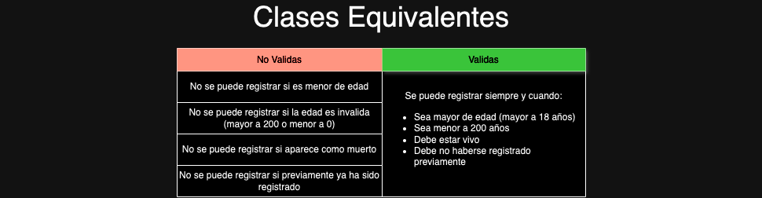

# Clases Equivalentes

Implementación de las clases equivalentes para pruebas basado en este repositorio: https://github.com/CesarAVegaF312/DYAS-TDD

## Ejecución
```
mvn test
```

## Clases Equivalentes generadas

